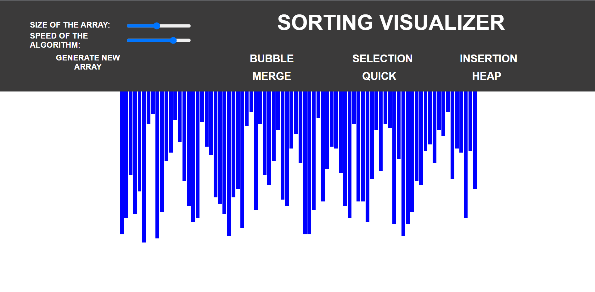

# Sorting Incarnator

Scripts to visualize popular sorting algorithms.

## About

The aim of this project is to make sorting algorithms easier to visualize and understand, using the capabilities of tkinter.

## Implemented Algorithms

* Bubble Sort
* Insertion Sort
* Selection Sort
* Merge Sort
* Quick Sort
* Heap Sort

## Built With

* HTML
* CSS
* JavaScript

## Usage

### To run locally

Under the root directory of the project, run the ```index.html``` file to open the website in your default web browser.

### To run online

Go to the website: https://sorting-visualiser.github.io/ to launch the visualizer

## Run it

The home page will look like this:

Sliders are given to select the size of the array and the speed of the sorting algorithm.
Click on the generate new array button to create a new array.
Select one of the given sorting algorithm to begin the visualization.


[Demo](https://user-images.githubusercontent.com/75522742/146026364-93f4774e-911f-4293-b903-983626e68fb8.mp4) Video 

